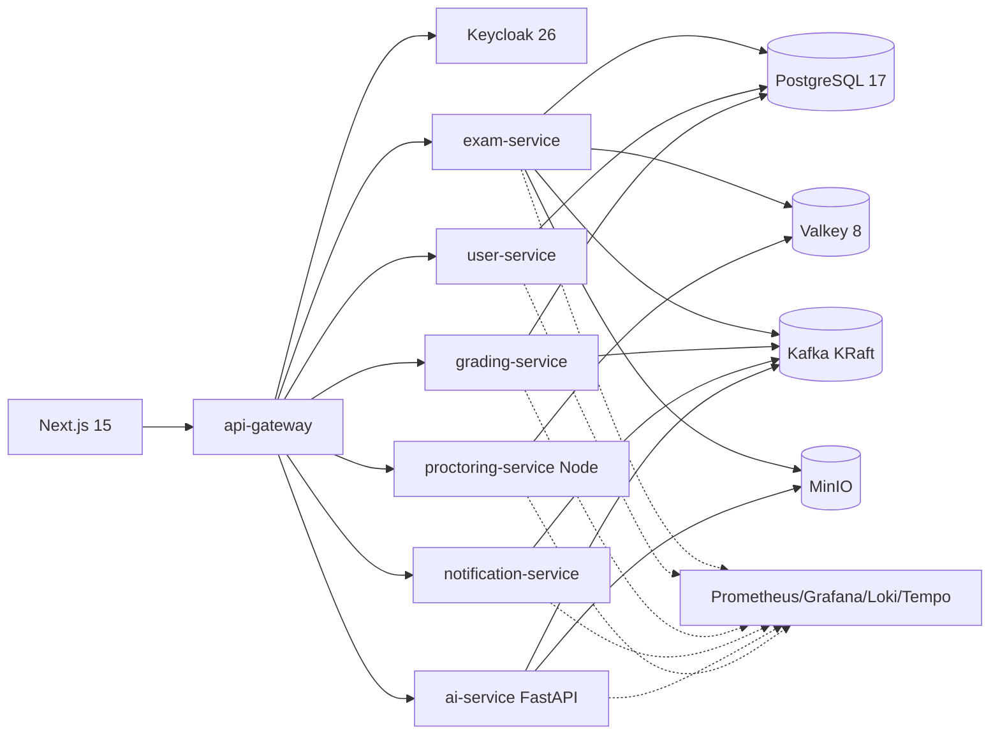

# Exameo

> Plateforme moderne de gestion d'examens en ligne. Architecture polyglotte microservices, IAM Keycloak, observabilité complète, IA pour la génération de questions et l'anti-triche.

[](https://github.com/aymenemassassi/Exameo/actions/workflows/ci.yml)
[](./LICENSE)

Exameo est la refonte ambitieuse d'une application Java EE legacy (`GestionExam`) en plateforme moderne destinée aux universités, écoles et organismes de certification.

## TL;DR

```bash
git clone https://github.com/aymenemassassi/Exameo
cd Exameo
docker compose -f infra/docker-compose.yml -f infra/docker-compose.observability.yml up -d
./gradlew :services:user-service:bootRun &
cd web && npm install && npm run dev
open http://localhost:3000
```

Comptes seed Keycloak : `student / student`, `teacher / teacher`, `proctor / proctor`, `admin / admin`.

## Pourquoi ce projet

- Démontrer la **maîtrise d'une stack moderne polyglotte de bout en bout** (Spring Boot 3.4 / Java 21, Next.js 15 RSC, FastAPI, Node/Fastify)
- Mettre en oeuvre les **bonnes pratiques de l'industrie** (DDD, Hexagonal, OpenAPI 3.1, RFC 9457, OWASP, observabilité OpenTelemetry, IaC, CI/CD, ADRs)
- Servir de **vitrine technique** : code lisible, README didactique, ADRs, diagrammes C4, dashboards Grafana, traces Tempo, tests Testcontainers/Playwright

## Apprendre la stack ([`docs/learn/`](./docs/learn/))

Exameo n'est pas qu'un projet livrable, c'est aussi une **vitrine pédagogique**. Le dossier [`docs/learn/`](./docs/learn/) contient un **livre de cours-tutoriels** écrits pour quelqu'un qui découvre les technologies (Docker, Spring Boot, Keycloak/OIDC, Next.js 15, Kafka, observabilité OpenTelemetry...).

- 10 cours rétroactifs sur l'existant — voir [carte de progression](./docs/learn/README.md)
- Glossaire transverse de 70+ termes — voir [`00-vocabulaire.md`](./docs/learn/00-vocabulaire.md)
- Sessions de développement guidé pour les nouvelles features — voir [`sessions/`](./docs/learn/sessions/)
- Mode d'emploi du dispositif — voir [`HOW-TO-USE.md`](./docs/learn/HOW-TO-USE.md)

Branche d'expérimentation : `learn/sandbox` (fork sécurisé de `main` pour les exercices).

## Fonctionnalités cibles

| Domaine | Détails |
|---|---|
| Auth & RBAC | Keycloak 26, OIDC, MFA TOTP, SSO Google/GitHub, rôles `student/teacher/proctor/admin` |
| Banque de questions | QCM single/multi, vrai/faux, ouverte courte/longue, code (Monaco), upload fichier, multilingue FR/EN/AR |
| Conception examen | Templates, tirage aléatoire pondéré, sections, coefficients, règles temps |
| Passage examen | Timer serveur autoritaire, autosave Valkey toutes les 10s, résilience reload, randomisation |
| Anti-triche IA | Webcam check, tab switch, fullscreen lock, similarity n-gram, score de confiance |
| Correction | Auto QCM/v-f, semi-auto ouverte (mots-clés + LLM), manuelle, regrade workflow |
| Analytics | Dashboards prof/élève/admin (distribution, item analysis, percentile, KPIs cohortes) |
| Notifications | Email (Mailpit dev / SMTP prod), in-app, ICS calendar |
| IA générative | Upload cours -> set de QCM proposé (FastAPI + LangChain, mode BYOK) |
| Export/Import | PDF sujets/corrigés/bulletins, CSV/XLSX notes, QTI 2.1, Moodle XML |

## Architecture



Diagrammes complets : voir [`docs/architecture.md`](./docs/architecture.md). Décisions : voir [`docs/adr/`](./docs/adr/).

## Stack technique

- **Frontend** : Next.js 15 (App Router, RSC), TypeScript strict, Tailwind CSS, shadcn/ui, TanStack Query, Zod, NextAuth (Keycloak)
- **Backend Java** : Spring Boot 3.4, Java 21 (Virtual Threads), Spring Cloud Gateway, Spring Security OAuth2 Resource Server, Flyway, JPA/Hibernate, Resilience4j, Testcontainers
- **AI** : FastAPI 0.115, Pydantic v2, LangChain, mode BYOK (Ollama local par défaut, OpenAI ou Anthropic optionnels)
- **Realtime** : Node.js 22, Fastify, Socket.IO, Zod
- **Identity** : Keycloak 26 (realm `exameo` provisioned)
- **Données** : PostgreSQL 17 (DB-per-service), Valkey 9 (BSD, fork open-source pur de Redis), Kafka 4.0 KRaft, MinIO
- **Observabilité** : Prometheus, Grafana 11, Loki, Tempo, OpenTelemetry Collector
- **CI/CD** : GitHub Actions (matrix Java/Node/Python, lint, tests, scan Trivy)

## Structure du repo

```
Exameo/
├─ docs/              ADRs, architecture, runbook, API contracts
├─ infra/             docker-compose, Keycloak realm, Grafana dashboards
├─ services/
│  ├─ api-gateway/    Spring Cloud Gateway
│  ├─ user-service/   Spring Boot 3.4
│  ├─ exam-service/   (Sprint 1)
│  ├─ grading-service/(Sprint 2)
│  ├─ notification-service/
│  ├─ ai-service/     FastAPI + LangChain
│  └─ proctoring-service/ Node + Fastify + Socket.IO
├─ web/               Next.js 15
├─ shared/openapi/    contrats partagés
├─ scripts/           bootstrap, seed-db, gen-types
└─ .github/workflows/ CI / sécurité
```

## Roadmap

- **Sprint 0 (livré)** : repo bootstrap, infra Docker Compose, observabilité, Keycloak realm, scaffolding api-gateway + user-service + web, CI, ADRs, docs C4
- **Sprint 1** : `exam-service` complet (CRUD examens, banque questions), pages prof, OpenAPI 3.1
- **Sprint 2** : passage examen (timer authoritative, autosave Valkey), `grading-service` (correction auto), pages étudiant
- **Sprint 3** : `ai-service` (génération QCM depuis PDF), `proctoring-service` (telemetrie webcam), MediaPipe frontend
- **Sprint 4** : i18n FR/EN/AR, a11y WCAG 2.2 AA, perf Lighthouse, sécurité OWASP ZAP, Storybook

## Démarrage rapide

### Prérequis

- Docker Desktop, JDK 21 (Temurin), Node 22, Git, GitHub CLI
- 16 Go de RAM recommandés (la stack complète tourne en local)

### Installation

```bash
git clone https://github.com/aymenemassassi/Exameo
cd Exameo
docker compose -f infra/docker-compose.yml -f infra/docker-compose.observability.yml up -d
```

### Lancer un service Java

```bash
cd services/user-service
../../gradlew bootRun
```

### Lancer le frontend

```bash
cd web
npm install
npm run dev
```

### URLs locales

| Service | URL |
|---|---|
| Frontend Next.js | http://localhost:3000 |
| API Gateway | http://localhost:8080 |
| Keycloak | http://localhost:8081 (admin / Admin123!) |
| Grafana | http://localhost:3001 (admin / admin) |
| Prometheus | http://localhost:9090 |
| Mailpit | http://localhost:8025 |
| MinIO console | http://localhost:9001 (minio / minio12345) |

## Tests

```bash
./gradlew test                      # backend Java (Testcontainers)
cd web && npm run test              # frontend (Vitest)
cd web && npm run test:e2e          # Playwright
cd services/ai-service && pytest    # AI
```

## Licence

[MIT](./LICENSE) - Aymene Massassi

## Crédits

Refonte du projet académique [GestionExam](https://github.com/aymenemassassi) en plateforme moderne. Vitrine pédagogique destinée à démontrer la maîtrise des stacks 2025-2026.
