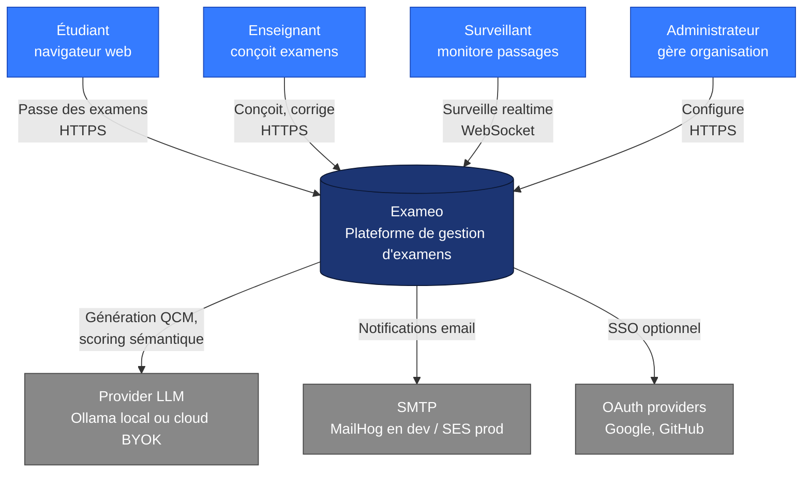
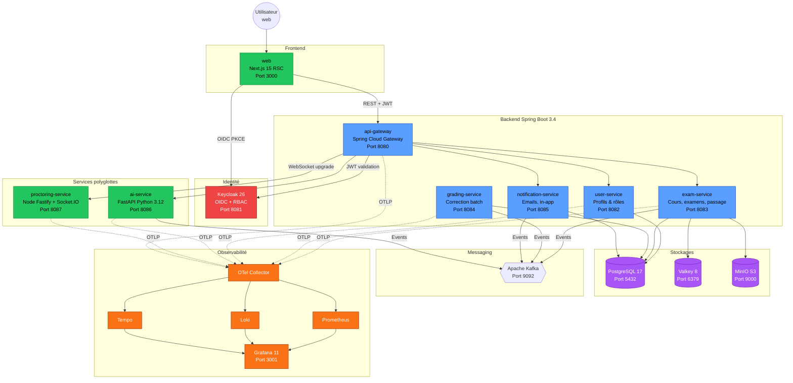
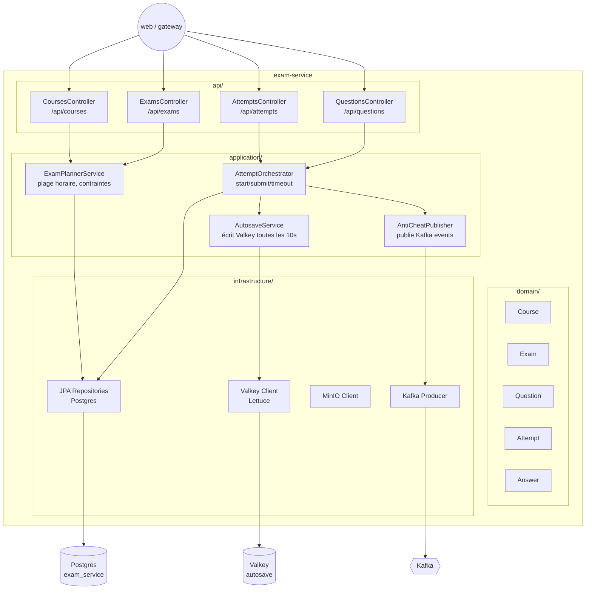
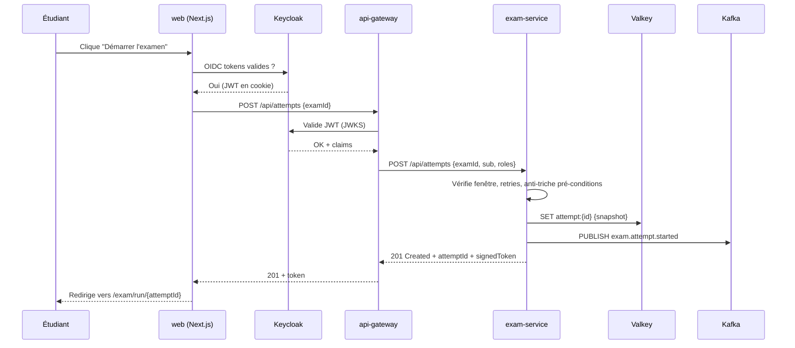
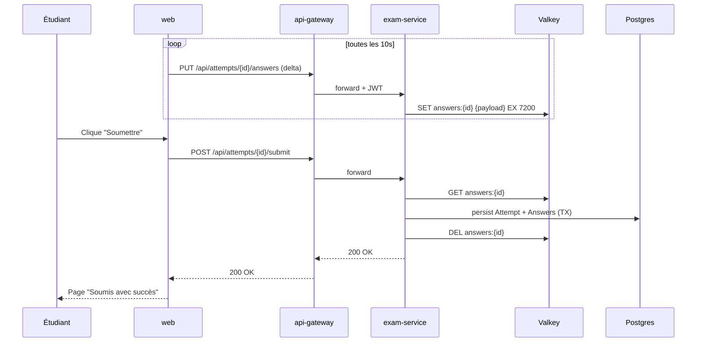

# Architecture Exameo

> Vue d'ensemble C4 (contexte, conteneurs, composants) de la plateforme Exameo.
> Diagrammes en Mermaid pour rendu natif sur GitHub.

## Sommaire

1. [Niveau 1 — Contexte système](#niveau-1--contexte-systeme)
2. [Niveau 2 — Conteneurs](#niveau-2--conteneurs)
3. [Niveau 3 — Composants `exam-service`](#niveau-3--composants-exam-service)
4. [Flux clés](#flux-cles)
5. [Choix structurants](#choix-structurants)

---

## Niveau 1 — Contexte système

**Acteurs** :

- **Étudiant** : crée un compte, s'inscrit à un cours, passe les examens dans une fenêtre temporelle, consulte ses résultats.
- **Enseignant** : crée des cours, conçoit des examens (QCM, vrai/faux, ouvert), corrige les réponses libres, publie des résultats.
- **Surveillant** : suit en temps réel les passages, reçoit des alertes anti-triche, valide les anomalies.
- **Administrateur** : gère utilisateurs, rôles, organisations, audit log, paramètres globaux.

---

## Niveau 2 — Conteneurs

**Conteneurs Spring Boot 3.4 / Java 21** : `api-gateway`, `user-service`, `exam-service`, `grading-service`, `notification-service`. Tous exposent `actuator/prometheus` et `actuator/health`. Auth via `oauth2-resource-server` + JWT JWKS.

**Conteneurs polyglottes** : `web` (Next.js 15 RSC), `ai-service` (FastAPI / LangChain), `proctoring-service` (Fastify / Socket.IO).

**Stockages** :

- **Postgres 17** : 1 base par service (cf. ADR-003).
- **Valkey 8** : cache HTTP, sessions, autosave examen, pub/sub léger (cf. ADR-004).
- **MinIO** : assets uploadés (sujets PDF, captures webcam de proctoring, exports CSV).

**Bus d'événements** : Kafka KRaft. Topics typés (`exam.attempt.started`, `exam.attempt.submitted`, `grading.completed`, `notification.email.requested`).

**Observabilité** : tous les services exportent traces/metrics/logs via OTLP au Collector. Stockage Prom + Loki + Tempo. Visualisation Grafana 11.

---

## Niveau 3 — Composants `exam-service`

`exam-service` est le cœur métier (planning, passage, autosave, soumission). Sprint 1+ — esquisse :

---

## Flux clés

### Démarrage d'un passage d'examen (Sprint 1)

### Autosave + soumission

---

## Choix structurants

Voir aussi les ADR :

- [ADR-001](./adr/001-polyglot-microservices.md) : Architecture polyglotte microservices
- [ADR-002](./adr/002-keycloak-iam.md) : Keycloak IAM
- [ADR-003](./adr/003-postgres-per-service.md) : Une DB Postgres par service
- [ADR-004](./adr/004-valkey-vs-redis.md) : Valkey 8 plutôt que Redis 7
- [ADR-005](./adr/005-byok-llm.md) : LLM en mode BYOK

### Sécurité (résumé)

- TLS partout en prod (HSTS), HTTP local en dev uniquement
- JWT RS256, JWKS rotation Keycloak
- CSP stricte côté web (cf. `next.config.mjs`)
- RFC 9457 ProblemDetail pour toutes les erreurs API
- Audit log : événements Kafka `audit.*` consommés et stockés (Sprint 2+)
- Secrets : jamais committés, `.env.example` placeholders, vault local possible (Sprint 3)

### Performance (cibles)

| Métrique | Cible |
|---|---|
| TTFB page `/me` (web) | < 200 ms |
| `GET /api/me` p95 | < 80 ms |
| `POST /api/attempts` p95 | < 250 ms |
| Autosave p99 | < 50 ms (Valkey) |
| Concurrent attempts soutenus | 500 sur poste local |

Mesures à instrumenter via OpenTelemetry et Grafana dashboards Sprint 1+.

### Évolutions prévues

- **Sprint 1** : `exam-service` complet, web `/exams`, `/exam/run`
- **Sprint 2** : `grading-service`, `ai-service` génération QCM
- **Sprint 3** : `proctoring-service` realtime, anti-triche scoring
- **Sprint 4** : analytics + RGPD export, déploiement Kubernetes minikube
