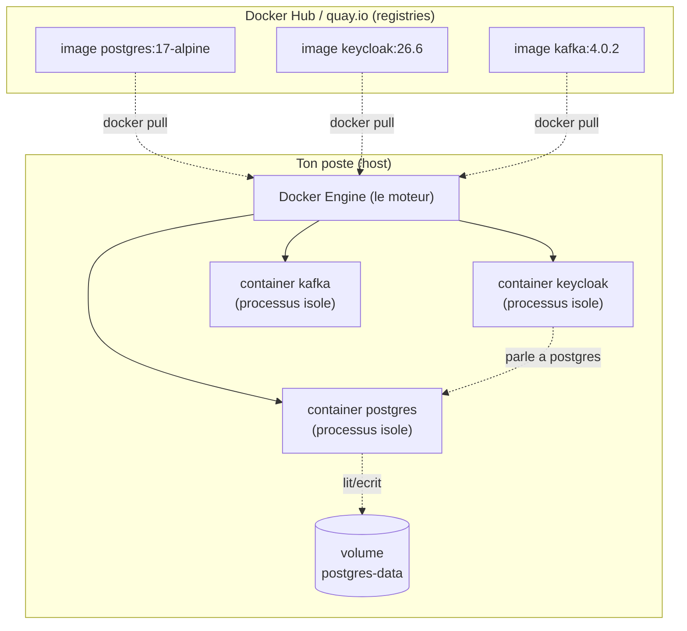

# Cours 01 — Docker & Docker Compose

> **Pré-requis :** aucun (tu connais déjà `docker compose up/down` mais on va creuser le pourquoi).
> **Durée cible :** 45 minutes (lecture 30 min + mini-exercice 15 min).
> **Ce que tu sauras à la fin :** lire et modifier `infra/docker-compose.yml` en comprenant chaque ligne ; diagnostiquer un service qui ne démarre pas ; expliquer pourquoi Exameo a fait tel ou tel choix d'image ou de healthcheck.

## Sommaire

- [1. Pourquoi Docker existe](#1-pourquoi-docker-existe)
- [2. Mental model — un container, c'est quoi vraiment](#2-mental-model--un-container-cest-quoi-vraiment)
- [3. Vocabulaire delta du cours](#3-vocabulaire-delta-du-cours)
- [4. Anatomie de `infra/docker-compose.yml`](#4-anatomie-de-infradocker-composeyml)
- [5. Tu joues — mini-exercice sur la sandbox](#5-tu-joues--mini-exercice-sur-la-sandbox)
- [6. Pour aller plus loin](#6-pour-aller-plus-loin)

---

## 1. Pourquoi Docker existe

### Le problème "ça marche chez moi"

Avant Docker (~2013), installer une stack comme celle d'Exameo voulait dire :

1. Installer Postgres 17 sur ton poste (avec la bonne version, le bon path d'install, le bon `pg_hba.conf`)
2. Installer Java 21 (pas 17 ni 23, sinon Spring Boot râle)
3. Installer Kafka, configurer Zookeeper (oui, à l'époque il fallait Zookeeper en plus)
4. Espérer que ton collègue ait fait les **mêmes** installs avec les **mêmes** versions
5. Quand un test casse en CI : *"ça marche chez moi"*

Le problème de fond : **ton appli dépend de tout l'environnement** (versions, libs système, variables d'env, ports), et cet environnement est différent partout (ton poste Windows, le poste Mac de ton collègue, le serveur Linux de prod).

### La solution : empaqueter l'environnement

Docker propose : *au lieu d'installer Postgres sur ton OS, on l'empaquette dans une **image** qui contient Postgres + ses libs + sa conf. Tu lances cette image, ça démarre un **container** isolé. Le container marche **identiquement** partout où Docker tourne.*

> **C'est ça l'idée centrale** : le container apporte son propre environnement. Ton OS (Windows, Mac, Linux) ne sert qu'à faire tourner le **moteur Docker**, qui à son tour fait tourner les containers.

### Container vs VM (en 2 lignes)

Une VM (machine virtuelle) embarque **tout un OS** (kernel Linux entier) — lourd (Go), lent à démarrer (minutes). Un container partage le **kernel** de l'OS hôte et n'embarque que **l'appli + ses libs userland** — léger (Mo), rapide (secondes).

Sous Windows/Mac, Docker triche un peu : il fait tourner une mini-VM Linux (WSL2 sur Windows, Hypervisor.framework sur Mac) et lance les containers dedans. Mais à l'usage, tu l'oublies — sauf quand WSL boude, on en reparle dans la section troubleshooting.

### Et `docker compose` dans tout ça ?

`docker run postgres:17` lance **un** container. Mais Exameo a besoin de **8 services qui se parlent** : Postgres, Valkey, Kafka, MinIO, Mailpit, Keycloak (+ init buckets MinIO + bootstrap réseau). Lancer ça à la main = 8 commandes longues, dans le bon ordre, avec les bonnes options réseau. Insupportable.

`docker compose` lit un fichier YAML qui **décrit toute la stack** (services, réseaux, volumes, dépendances) et fait le boulot pour toi. C'est ce qui rend `docker compose up` magique.

> **Le vrai luxe** : un nouveau dev clone le repo, exécute `docker compose -f infra/docker-compose.yml up -d`, et 60 secondes plus tard il a la même stack que toi, avec exactement les mêmes versions. Plus de "ça marche chez moi". C'est ça la promesse Exameo.

---

## 2. Mental model — un container, c'est quoi vraiment

### Le schéma mental à garder en tête



À retenir en 4 phrases :

1. **Une image = un modèle figé** stocké dans un registry (Docker Hub, quay.io). Tu la télécharges (`docker pull`).
2. **Un container = une instance vivante** de cette image. Tu en lances autant que tu veux à partir de la même image.
3. Les containers sont **isolés** : chacun a son propre filesystem, ses propres processus, ses propres ports. Ils communiquent par le **réseau** (Docker network) ou par des **volumes** partagés.
4. Quand tu détruis un container, tu perds tout ce qu'il contenait — **sauf** ce qui était dans un volume monté (les volumes survivent aux containers).

### Trois questions pour ancrer

> **Q : Si je relance `docker compose up`, mes données Postgres sont-elles perdues ?**
> R : Non, parce que `infra/docker-compose.yml` monte un volume `postgres-data:/var/lib/postgresql/data`. Le container est jeté, le volume survit, le nouveau container reprend les données.

> **Q : Pourquoi Keycloak s'appelle `keycloak` dans son URL JDBC `jdbc:postgresql://postgres:5432/keycloak` ? "postgres" n'est pas une URL valide ?**
> R : Si, dans le **réseau Docker `exameo`**. Compose crée un mini-DNS interne : chaque service est joignable par **son nom de service**. Pour Keycloak, `postgres` résout vers l'IP du container Postgres. Magic.

> **Q : Pourquoi je peux faire `psql -h localhost -p 5432` depuis mon poste pour me connecter à Postgres ?**
> R : Parce que dans le compose, on a `ports: - "5432:5432"`. Ça **publie** le port 5432 du container sur le port 5432 de ton OS hôte. Sans cette ligne, Postgres serait joignable **uniquement** depuis le réseau Docker `exameo`, pas depuis ton poste.

---

## 3. Vocabulaire delta du cours

Ces termes n'étaient pas (ou peu) dans le glossaire avant le cours. Ils y seront ajoutés après.

| Terme | Définition courte |
|---|---|
| **Image layer** *(layer)* | Une image est composée d'une **pile de couches** immuables (chaque instruction `Dockerfile` = 1 layer). Permet de cacher et de partager entre images. |
| **Tag** *(image tag)* | Étiquette de version sur une image (`postgres:17-alpine` = nom `postgres` + tag `17-alpine`). Pinner un tag précis évite les surprises de mise à jour. |
| **Pinning** | Pratique de figer un tag à une version exacte (vs `:latest` qui change sans prévenir). Chez Exameo : tous les tags sont pinnés. |
| **Pull** *(docker pull)* | Téléchargement d'une image depuis un registry vers le moteur local. |
| **Bind mount** | Montage qui expose un **dossier de l'hôte** dans le container (ex : `./postgres/init:/docker-entrypoint-initdb.d:ro`). Pratique en dev pour partager des fichiers de conf. |
| **Named volume** | Volume **géré par Docker** (stocké dans `/var/lib/docker/volumes/...`), avec un nom logique (`postgres-data`). Préféré pour les données persistantes en prod. |
| **Port mapping / publish** | Expose un port du container sur l'hôte (`HOST:CONTAINER`). |
| **Service (Compose)** | Un bloc `services:` du compose. Représente un container (ou plusieurs si on scale). |
| **Compose project name** | Préfixe appliqué à tous les containers/volumes/networks créés. Chez Exameo : `name: exameo` en haut du compose, donc on a `exameo-postgres`, `exameo-kafka`. |
| **Healthcheck** | Commande exécutée périodiquement dans le container pour dire "je suis prêt" / "je suis cassé". |
| **`depends_on` + condition** | Dépendance d'ordre de démarrage entre services. Avec `condition: service_healthy`, Compose attend que le healthcheck passe avant de lancer le suivant. |
| **`restart: unless-stopped`** | Politique de redémarrage : si le container crash ou que la machine reboot, Docker le relance (sauf si tu l'as explicitement arrêté). |
| **YAML anchor (`&` et `*`)** | Syntaxe YAML pour **réutiliser** un bloc (`x-default-logging: &default-logging` puis `logging: *default-logging`). Évite la duplication. |
| **`x-` prefix** | Conventions YAML/Compose pour des blocs **personnalisés** ignorés par le parseur (utiles pour les anchors). |
| **`entrypoint` vs `command`** | `entrypoint` = programme principal du container (souvent fixé dans l'image). `command` = arguments passés à l'entrypoint (override possible). |
| **`Dockerfile`** | Recette texte pour **construire** une image custom (instructions `FROM`, `RUN`, `COPY`, `CMD`...). Exameo n'en a pas encore, on utilise des images pré-construites. |
| **Registry public/privé** | `docker.io` (Docker Hub, public, défaut) — `quay.io` (Red Hat, public, héberge Keycloak) — Nexus/Harbor (privés, en entreprise). |
| **Docker Desktop** | Application Windows/Mac qui packagee Docker Engine + WSL2 + UI. C'est ce que tu lances avant `docker compose up`. |
| **WSL2** *(Windows Subsystem for Linux)* | Mini Linux dans Windows. Docker Desktop l'utilise pour faire tourner les containers (qui sont des process Linux). |
| **`exec` (docker exec)** | Lance une commande dans un container **déjà en route** (`docker exec -it exameo-postgres psql -U exameo`). |
| **Init container** | Container "jetable" qui fait un setup une fois puis s'arrête (chez Exameo : `minio-init` qui crée les buckets). Pattern classique. |

---

## 4. Anatomie de `infra/docker-compose.yml`

On ouvre le **vrai fichier Exameo** et on le décortique. Tu peux l'avoir ouvert en parallèle dans ton IDE.

### 4.1 L'en-tête

```1:11:infra/docker-compose.yml
name: exameo

# =============================================================================
# Exameo - Stack metier (dev local)
# Postgres 17, Valkey 9, Apache Kafka 4 (KRaft), MinIO, Mailpit, Keycloak 26.
# Lancer : docker compose -f infra/docker-compose.yml up -d
#
# Tags pinnes sur des versions reellement disponibles (verifie sur Docker Hub
# / quay.io en avril 2026).
# =============================================================================
```

- `name: exameo` — Le **project name**. Tous les containers, volumes, networks créés par ce compose seront préfixés `exameo-` (sinon Docker prend le nom du dossier, ici `infra`, ce qui est moche). Tu vérifies avec `docker compose ls`.
- Le commentaire de version est plus important qu'il n'en a l'air : Docker images sont **mutables côté nommage** mais **immuables côté contenu**. Si tu pin `postgres:17-alpine` aujourd'hui et que demain ils repackagent (rare), tu peux te retrouver avec un autre binaire. Pour la prod, on pinne aussi le **digest SHA256**. Pour du dev, le tag suffit.

### 4.2 Le bloc anchor `x-default-logging`

```12:16:infra/docker-compose.yml
x-default-logging: &default-logging
  driver: json-file
  options:
    max-size: "10m"
    max-file: "3"
```

Trois choses ici :

1. **`x-` prefix** : Compose ignore les clés qui commencent par `x-`. Ça permet de définir des blocs custom **sans casser le parsing**.
2. **`&default-logging`** est un **anchor YAML** (un nom de référence).
3. Plus bas, chaque service écrit `logging: *default-logging` (le `*` est un **alias** vers l'anchor) — ce qui inline tout le bloc.

Concrètement, sans cette astuce, on devrait répéter le bloc `driver: json-file ...` **8 fois**. Là on l'écrit une fois, on le réutilise. Bonne pratique YAML universelle, pas spécifique Docker.

**Pourquoi ce logging ?** Par défaut, Docker écrit les logs sans limite de taille. Sur un poste dev qui tourne plusieurs jours, le fichier de log d'un container chatty peut faire **plusieurs Go**. Ici on cap à `10m × 3 fichiers = 30 Mo max par container`. Ça t'évite de saturer ton disque (souvenir du dernier coup de panique 😬).

### 4.3 Service `postgres`

```22:43:infra/docker-compose.yml
postgres:
    image: postgres:17-alpine
    container_name: exameo-postgres
    restart: unless-stopped
    environment:
      POSTGRES_USER: ${POSTGRES_USER:-exameo}
      POSTGRES_PASSWORD: ${POSTGRES_PASSWORD:-exameo}
      POSTGRES_DB: ${POSTGRES_DB:-exameo}
    ports:
      - "5432:5432"
    volumes:
      - postgres-data:/var/lib/postgresql/data
      - ./postgres/init:/docker-entrypoint-initdb.d:ro
    healthcheck:
      test: ["CMD-SHELL", "pg_isready -U ${POSTGRES_USER:-exameo}"]
      interval: 5s
      timeout: 5s
      retries: 10
    logging: *default-logging
    networks:
      - exameo
```

Ligne par ligne :

- **`image: postgres:17-alpine`** — On utilise l'**image officielle Postgres**, version 17, variante **Alpine** (Linux ultra-léger, ~80 Mo vs ~400 Mo pour la variante Debian). Important : la communauté Postgres maintient cette image, on bénéficie des patchs de sécurité gratos.
- **`container_name: exameo-postgres`** — Force le nom du container. Sans cette ligne, Docker générerait un nom auto (`exameo-postgres-1`). Ici on veut un nom prévisible pour pouvoir taper `docker logs exameo-postgres` sans deviner.
- **`restart: unless-stopped`** — Si le container plante ou si tu reboot Windows, Docker le relance. Sauf si tu as explicitement fait `docker stop` ou `docker compose down`. Confortable en dev.
- **`environment:`** — Les variables d'env passées au process. Notez la syntaxe `${POSTGRES_USER:-exameo}` : *"prend la variable d'env `POSTGRES_USER` si elle existe (lue depuis `.env`), sinon utilise `exameo` par défaut"*. Ça te permet de **surcharger sans modifier le YAML** (parfait pour des prod où tu veux mettre un vrai mot de passe).
- **`ports: - "5432:5432"`** — Format `HOST:CONTAINER`. Le port **5432 du container** est publié sur le **port 5432 de ton OS**. Tu peux donc ouvrir DBeaver et te connecter à `localhost:5432` comme si Postgres tournait nativement. Si le port 5432 est déjà pris (autre Postgres), tu peux faire `"5433:5432"` : tu accèdes via `localhost:5433` mais Keycloak parle toujours au port `5432` interne (parce qu'il passe par le réseau Docker, pas par localhost).
- **`volumes:`** — Deux montages, **deux types différents** :
  - `postgres-data:/var/lib/postgresql/data` — **Named volume** (pas de slash devant). Docker le crée automatiquement, le nom complet sera `exameo_postgres-data`. Les données Postgres y sont stockées et **survivent** aux `docker compose down`.
  - `./postgres/init:/docker-entrypoint-initdb.d:ro` — **Bind mount** (commence par `.`). Le dossier local `infra/postgres/init/` est exposé en **lecture seule** (`:ro`) dans le container. C'est une convention Postgres : tous les `.sh` et `.sql` placés là sont exécutés au **premier boot**.
- **`healthcheck:`** — Toutes les 5 secondes, Docker lance `pg_isready -U exameo` dans le container. Si la commande sort en code 0, le container est `healthy`. Sinon il essaie 10 fois avant de le marquer `unhealthy`. C'est ce qui permet à Keycloak (plus bas) d'attendre que Postgres soit **réellement prêt** avant de démarrer (pas juste "le container est up", mais "Postgres écoute").
- **`networks: - exameo`** — Le container rejoint le réseau `exameo` (défini en bas du fichier).

### 4.4 Le réseau `exameo`

```216:219:infra/docker-compose.yml
networks:
  exameo:
    name: exameo
    driver: bridge
```

- **`driver: bridge`** — Le driver par défaut. Crée un pont virtuel sur ton OS (`br-xxxx` visible en `docker network inspect`). Tous les containers branchés ont une IP dans le même sous-réseau et peuvent se parler.
- **`name: exameo`** — Sans cette ligne, le réseau s'appelle `exameo_exameo` (project + key). En forçant le nom, on permet à `docker-compose.observability.yml` (l'autre fichier) d'y rejoindre comme **réseau externe** (`external: true`).

**Le gros point à comprendre** : dans ce réseau, **chaque service est joignable par son nom**. Pas besoin d'IP, pas besoin de DNS externe :

- `postgres:5432` → IP du container postgres
- `keycloak:8080` → IP du container keycloak
- `kafka:19092` → IP du container kafka

C'est pour ça que Keycloak a `KC_DB_URL: jdbc:postgresql://postgres:5432/keycloak`. Le hostname `postgres` n'existe **que** dans ce réseau Docker.

### 4.5 Le bloc `valkey`

```47:63:infra/docker-compose.yml
valkey:
    image: valkey/valkey:9-alpine
    container_name: exameo-valkey
    restart: unless-stopped
    command: ["valkey-server", "--save", "60", "1", "--appendonly", "yes"]
    ports:
      - "6379:6379"
    volumes:
      - valkey-data:/data
    healthcheck:
      test: ["CMD", "valkey-cli", "ping"]
      interval: 5s
      timeout: 3s
      retries: 10
    logging: *default-logging
    networks:
      - exameo
```

Deux nouveautés :

- **`command:`** — Override la commande par défaut de l'image. Ici on passe à `valkey-server` les options de **persistance** : *"sauvegarde sur disque toutes les 60s s'il y a au moins 1 modif (`--save 60 1`), et écris aussi un journal append-only (`--appendonly yes`) pour la durabilité."* Sans ça, Valkey serait purement en mémoire et perdrait tout au restart.
- **`healthcheck` avec `CMD` simple** — Pas de `CMD-SHELL` cette fois. La nuance :
  - `CMD` lance directement la commande (pas de shell, pas d'expansion de variables) — plus rapide, plus sûr
  - `CMD-SHELL` passe par `/bin/sh -c "..."` — nécessaire si tu fais des pipes, des redirections, ou de l'expansion `${VAR}`

> **Pourquoi Valkey et pas Redis ?** Voir [`docs/adr/004-valkey-vs-redis.md`](../adr/004-valkey-vs-redis.md). En 2 mots : Redis a changé sa licence en 2024 (BSL/SSPL, plus open-source pur), Valkey est le fork Linux Foundation BSD pur, compatible API à 100%.

### 4.6 Le bloc `kafka` (le plus complexe)

```71:102:infra/docker-compose.yml
kafka:
    image: apache/kafka:4.0.2
    container_name: exameo-kafka
    hostname: kafka
    restart: unless-stopped
    environment:
      KAFKA_NODE_ID: 1
      KAFKA_PROCESS_ROLES: "broker,controller"
      KAFKA_LISTENERS: "CONTROLLER://:29093,PLAINTEXT://:19092,PLAINTEXT_HOST://:9092"
      KAFKA_ADVERTISED_LISTENERS: "PLAINTEXT://kafka:19092,PLAINTEXT_HOST://localhost:9092"
      KAFKA_LISTENER_SECURITY_PROTOCOL_MAP: "CONTROLLER:PLAINTEXT,PLAINTEXT:PLAINTEXT,PLAINTEXT_HOST:PLAINTEXT"
      KAFKA_INTER_BROKER_LISTENER_NAME: "PLAINTEXT"
      KAFKA_CONTROLLER_LISTENER_NAMES: "CONTROLLER"
      KAFKA_CONTROLLER_QUORUM_VOTERS: "1@kafka:29093"
      KAFKA_OFFSETS_TOPIC_REPLICATION_FACTOR: 1
      KAFKA_TRANSACTION_STATE_LOG_REPLICATION_FACTOR: 1
      KAFKA_TRANSACTION_STATE_LOG_MIN_ISR: 1
      KAFKA_GROUP_INITIAL_REBALANCE_DELAY_MS: 0
      KAFKA_AUTO_CREATE_TOPICS_ENABLE: "true"
      CLUSTER_ID: "exameo-kraft-cluster-1xxxxxxxxxxxxxx"
      KAFKA_LOG_DIRS: "/tmp/kraft-combined-logs"
    ports:
      - "9092:9092"
    healthcheck:
      test: ["CMD-SHELL", "/opt/kafka/bin/kafka-topics.sh --bootstrap-server localhost:9092 --list >/dev/null 2>&1 || exit 1"]
      interval: 10s
      timeout: 10s
      retries: 12
      start_period: 30s
    logging: *default-logging
    networks:
      - exameo
```

On va se concentrer sur **3 trucs Docker** (le détail Kafka est pour le cours 08) :

1. **`hostname: kafka`** — Force le hostname **interne** au container. Important pour Kafka, qui s'annonce lui-même aux clients via `KAFKA_ADVERTISED_LISTENERS`. Si le hostname interne ne match pas, les clients ne peuvent pas se reconnecter après le premier handshake.

2. **Deux listeners, deux usages** :
   - `PLAINTEXT://kafka:19092` — Utilisé par les **services dans le réseau Docker** (les microservices Java appellent `kafka:19092`). Le hostname `kafka` est résolu par le DNS Docker.
   - `PLAINTEXT_HOST://localhost:9092` — Utilisé depuis **ton poste host** (un script Python qui produit des messages depuis ton IDE). Le port 9092 est publié dans `ports:`.

   C'est le pattern classique **dual listener** : une URL pour "à l'intérieur du réseau Docker", une autre pour "depuis l'extérieur". Sans ça, soit tu casses l'accès interne, soit tu casses l'accès externe.

3. **`start_period: 30s`** dans le healthcheck — Pendant les 30 premières secondes du démarrage, les échecs du healthcheck **ne comptent pas**. Kafka 4 met ~15-25s à démarrer (KRaft init, log dirs, listeners). Sans `start_period`, Docker compterait les échecs comme des "retries" et le container serait `unhealthy` avant même d'avoir eu le temps de finir de booter.

> **Note d'archi historique** : avant Kafka 3.3, il fallait **Zookeeper en plus** pour la coordination entre brokers. KRaft (= Kafka Raft) supprime cette dépendance. Sur Exameo on est sur Kafka 4 KRaft = un seul container.

### 4.7 Le bloc `minio` + l'init container

```107:148:infra/docker-compose.yml
minio:
    image: minio/minio:RELEASE.2025-09-07T16-13-09Z
    container_name: exameo-minio
    restart: unless-stopped
    command: server /data --console-address ":9001"
    environment:
      MINIO_ROOT_USER: ${MINIO_ROOT_USER:-minio}
      MINIO_ROOT_PASSWORD: ${MINIO_ROOT_PASSWORD:-minio12345}
    ports:
      - "9000:9000"
      - "9001:9001"
    volumes:
      - minio-data:/data
    healthcheck:
      test: ["CMD", "curl", "-f", "http://localhost:9000/minio/health/live"]
      interval: 10s
      timeout: 5s
      retries: 10
    logging: *default-logging
    networks:
      - exameo

  # ---------------------------------------------------------------------------
  # MinIO bucket bootstrap (idempotent)
  # ---------------------------------------------------------------------------
  minio-init:
    image: minio/mc:RELEASE.2025-08-13T08-35-41Z
    container_name: exameo-minio-init
    depends_on:
      minio:
        condition: service_healthy
    entrypoint: >
      /bin/sh -c "
      mc alias set local http://minio:9000 ${MINIO_ROOT_USER:-minio} ${MINIO_ROOT_PASSWORD:-minio12345};
      mc mb -p local/exameo-uploads || true;
      mc mb -p local/exameo-exports || true;
      mc mb -p local/exameo-ai-corpus || true;
      mc anonymous set download local/exameo-exports || true;
      echo 'MinIO buckets ready';
      "
    networks:
      - exameo
```

Trois points :

1. **Tag MinIO weird** — `RELEASE.2025-09-07T16-13-09Z` au lieu d'un numéro de version. C'est la **convention MinIO** : pas de SemVer, juste un timestamp ISO 8601. Plus précis (releases plusieurs fois par mois) mais moins lisible. C'est leur choix, on s'y plie.

2. **Le pattern "init container"** — `minio-init` est un **container jetable** qui :
   - Attend que MinIO soit healthy (`depends_on: condition: service_healthy`)
   - Lance la CLI MinIO (`mc`) pour créer 3 buckets
   - Sort proprement
   - **Reste en état "exited (0)"** dans `docker ps -a`

   C'est idempotent : tu peux relancer `docker compose up` 100 fois, il refera tout sans erreur (le `|| true` ignore l'erreur si le bucket existe déjà). Pattern classique pour le **bootstrap** d'un service qui a besoin d'une init unique.

3. **`entrypoint:` multiline** — Le `>` est une syntaxe YAML qui **fold les newlines en espaces**. La commande devient en pratique : `/bin/sh -c "mc alias set ...; mc mb ...; mc mb ...; ..."`. Plus lisible que tout sur une ligne.

### 4.8 Le bloc `keycloak`

```171:208:infra/docker-compose.yml
keycloak:
    image: quay.io/keycloak/keycloak:26.6
    container_name: exameo-keycloak
    restart: unless-stopped
    command: ["start-dev", "--import-realm", "--http-port=8080"]
    environment:
      KC_BOOTSTRAP_ADMIN_USERNAME: ${KEYCLOAK_ADMIN:-admin}
      KC_BOOTSTRAP_ADMIN_PASSWORD: ${KEYCLOAK_ADMIN_PASSWORD:-Admin123!}
      KC_DB: postgres
      KC_DB_URL: jdbc:postgresql://postgres:5432/keycloak
      KC_DB_USERNAME: ${POSTGRES_USER:-exameo}
      KC_DB_PASSWORD: ${POSTGRES_PASSWORD:-exameo}
      KC_HOSTNAME: ${KC_HOSTNAME:-localhost}
      KC_HOSTNAME_STRICT: "false"
      KC_HTTP_ENABLED: "true"
      KC_HEALTH_ENABLED: "true"
      KC_METRICS_ENABLED: "true"
    ports:
      - "${KC_HTTP_PORT:-8081}:8080"
    volumes:
      - ./keycloak/realms:/opt/keycloak/data/import:ro
    depends_on:
      postgres:
        condition: service_healthy
    healthcheck:
      test:
        - "CMD-SHELL"
        - >-
          exec 3<>/dev/tcp/localhost/9000 &&
          printf 'GET /health/ready HTTP/1.1\r\nHost: localhost\r\nConnection: close\r\n\r\n' >&3 &&
          timeout 3 cat <&3 | grep -q 'UP'
      interval: 10s
      timeout: 5s
      retries: 30
      start_period: 60s
    logging: *default-logging
    networks:
      - exameo
```

Choses intéressantes Docker (le détail Keycloak est pour le cours 04) :

- **Registry non-Docker-Hub** : `quay.io/keycloak/keycloak:26.6`. Le préfixe `quay.io/` indique un autre registry (Red Hat). Sans préfixe, Docker assume `docker.io/library/`.

- **`ports: - "${KC_HTTP_PORT:-8081}:8080"`** — Port mapping **paramétré par variable d'env**. Si tu as déjà une appli sur le 8080 (Tomcat, autre Keycloak), tu mets `KC_HTTP_PORT=8082` dans `.env` et c'est résolu. Le `8080` à droite reste fixe (port interne du container, c'est ce que Keycloak écoute).

- **`depends_on` avec condition `service_healthy`** — Compose attend que Postgres soit **réellement prêt** (healthcheck OK) avant de démarrer Keycloak. Sans cette condition, Keycloak démarrerait en parallèle de Postgres, échouerait à se connecter, et... ne se reconnecterait pas (Keycloak n'a pas de retry au boot). Crash.

- **Le healthcheck *exotique* avec `/dev/tcp`** — Cette syntaxe utilise une **fonctionnalité bash** (`/dev/tcp/<host>/<port>`) qui ouvre un socket TCP **sans avoir besoin de `curl` ou `wget`**. Pourquoi ? L'image Keycloak est **distroless minimal** (pas de curl, pas de wget). Hack élégant pour faire un health check HTTP avec uniquement bash.

- **`start_period: 60s`** — Keycloak met 30-50s à booter (init JPA, import realm, lifecycle Quarkus). 60s de grâce.

### 4.9 Le bas du fichier — déclaration des volumes et networks

```210:219:infra/docker-compose.yml
# =============================================================================
volumes:
  postgres-data:
  valkey-data:
  minio-data:

networks:
  exameo:
    name: exameo
    driver: bridge
```

- **Déclaration des volumes** — Tous les `named volumes` référencés dans `services:` doivent être **déclarés** ici. C'est juste une liste de noms, Docker fait le reste (création, gestion).
- Les volumes seront stockés sous Linux dans `/var/lib/docker/volumes/exameo_postgres-data/`. Sous Windows/Docker Desktop, c'est dans la VHDX du WSL. Tu peux les inspecter via `docker volume ls` puis `docker volume inspect exameo_postgres-data`.

### 4.10 Le compose observabilité — comment 2 fichiers se composent

Exameo a un **deuxième compose** : `infra/docker-compose.observability.yml` (Prometheus, Grafana, Loki, Tempo). Pourquoi séparé ?

- En dev quotidien, tu n'as souvent pas besoin de l'observabilité — gain de RAM
- Tu peux le démarrer **à la demande** quand tu veux investiguer

La commande pour combiner :

```bash
docker compose \
  -f infra/docker-compose.yml \
  -f infra/docker-compose.observability.yml \
  up -d
```

Et la **clé** qui permet aux 2 fichiers de partager le même réseau :

```128:131:infra/docker-compose.observability.yml
networks:
  exameo:
    name: exameo
    external: true
```

Le `external: true` veut dire : *"n'essaie pas de créer ce réseau, il existe déjà (créé par l'autre compose)."* Sinon le 2ème compose tenterait de créer un réseau de même nom et planterait.

### 4.11 Le script d'init Postgres

```1:20:infra/postgres/init/01-create-databases.sh
#!/usr/bin/env bash
# Crée une base de données par microservice (DB-per-service).
# Exécuté automatiquement par l'image postgres au premier boot.

set -euo pipefail

create_db_if_missing() {
  local db="$1"
  if ! psql -tAc "SELECT 1 FROM pg_database WHERE datname='${db}'" | grep -q 1; then
    echo "Creating database ${db}";
    psql -v ON_ERROR_STOP=1 -c "CREATE DATABASE ${db} OWNER ${POSTGRES_USER}";
  else
    echo "Database ${db} already exists";
  fi
}

for DB in keycloak users exams gradings notifications; do
  create_db_if_missing "${DB}"
done
```

Ce script est **monté** dans le container Postgres via le bind mount `./postgres/init:/docker-entrypoint-initdb.d:ro`. Au **premier boot** (quand le volume `postgres-data` est vide), l'image Postgres exécute automatiquement tous les `.sh` et `.sql` de ce dossier dans l'ordre alphabétique.

**Piège classique** (qu'on a déjà vécu) : ce script ne s'exécute qu'**une seule fois**, au tout premier démarrage. Si le volume `postgres-data` existe déjà (parce que tu as déjà lancé le compose une fois), le script est **ignoré**. Si tu veux le re-jouer, il faut **détruire le volume** :

```bash
docker compose -f infra/docker-compose.yml down -v   # le -v supprime les volumes
docker compose -f infra/docker-compose.yml up -d     # recree tout from scratch
```

> **`set -euo pipefail`** : convention bash pour rendre le script strict. `-e` = stop au premier échec, `-u` = erreur si variable non définie, `-o pipefail` = un pipe `cmd1 | cmd2` échoue si `cmd1` échoue (par défaut bash ignore l'échec du membre de gauche). À utiliser dans **tous tes scripts bash sérieux**.

---

## 5. Tu joues — mini-exercice sur la sandbox

### Setup

```bash
git checkout learn/sandbox
git pull origin learn/sandbox
git rebase origin/main          # rejoue la sandbox sur main a jour
```

### L'exercice (durée : 15-20 min)

**Objectif :** ajouter un nouveau service Docker Compose qui démarre **Adminer** (interface web pour explorer Postgres), branché sur le réseau `exameo`, accessible sur `http://localhost:8089`.

C'est un exercice volontairement simple pour consolider 5 notions du cours :

1. Choisir un tag d'image pinné (pas `:latest`)
2. Configurer un port mapping
3. Rejoindre le réseau Docker
4. Utiliser `depends_on`
5. Vérifier que tout marche

### Les étapes

**1.** Ouvre `infra/docker-compose.yml`.

**2.** Ajoute un nouveau service à la fin (avant la section `volumes:`) :

```yaml
  adminer:
    image: adminer:5.4.0     # va verifier la derniere stable sur https://hub.docker.com/_/adminer
    container_name: exameo-adminer
    restart: unless-stopped
    environment:
      ADMINER_DEFAULT_SERVER: postgres
    ports:
      - "8089:8080"
    depends_on:
      postgres:
        condition: service_healthy
    logging: *default-logging
    networks:
      - exameo
```

**3.** Démarre uniquement le nouveau service (sans relancer toute la stack) :

```bash
docker compose -f infra/docker-compose.yml up -d adminer
```

**4.** Vérifie qu'il est up :

```bash
docker compose -f infra/docker-compose.yml ps
```

Tu dois voir une ligne `exameo-adminer` avec status `Up`.

**5.** Ouvre dans ton navigateur : http://localhost:8089

Connecte-toi avec :

- System: `PostgreSQL`
- Server: `postgres` (le nom du service Docker, pas `localhost` !)
- Username: `exameo`
- Password: `exameo`
- Database: `users` (ou `keycloak`, `exams`, `gradings`...)

**6.** Bonus — ouvre un shell dans le container Postgres pour vérifier le hostname interne :

```bash
docker exec -it exameo-postgres bash
# une fois dans le container :
ping -c 2 adminer    # doit resoudre vers une IP du reseau exameo
exit
```

(L'image Postgres Alpine n'a pas `ping` par défaut, tu peux installer `apk add iputils-ping` ou juste utiliser `getent hosts adminer`.)

### Commit l'exercice

```bash
git add infra/docker-compose.yml
git commit -m "exo S01: ajoute Adminer pour explorer la DB"
git push origin learn/sandbox
```

### Critère de réussite

- [ ] `docker compose ps` montre `exameo-adminer` en `Up`
- [ ] Tu peux ouvrir Adminer sur localhost:8089 et te connecter à la DB `users`
- [ ] Tu comprends pourquoi tu as mis `Server: postgres` et pas `Server: localhost`

### Pour aller plus loin (optionnel)

- Essaye de **casser** le réseau : remplace `Server: postgres` par `Server: localhost` dans Adminer. Que se passe-t-il ? Pourquoi ?
- Ajoute un healthcheck à Adminer (indice : `wget --spider http://localhost:8080`)
- Que se passe-t-il si tu mets `ports: - "5432:8080"` ? Pourquoi ?

Quand tu as fini, ping-moi pour debrief.

---

## 6. Pour aller plus loin

### Doc officielle (référence)

- **[Docker Compose specification](https://github.com/compose-spec/compose-spec/blob/main/spec.md)** — La spec complète, hébergée par la Linux Foundation. C'est la **seule source de vérité** pour les options YAML.
- **[Docker Hub](https://hub.docker.com/)** — Registry public par défaut. Onglet "Tags" de chaque image pour voir les versions disponibles.
- **[Postgres Docker docs](https://hub.docker.com/_/postgres)** — La page officielle Postgres explique le `docker-entrypoint-initdb.d` et toutes les vars d'env.

### Concepts approfondis

- **[Best practices for writing Dockerfiles](https://docs.docker.com/develop/develop-images/dockerfile_best-practices/)** — Quand on commencera à écrire nos propres Dockerfiles (Sprint 1+), à lire avant.
- **[Compose `depends_on` and `condition`](https://docs.docker.com/compose/compose-file/05-services/#depends_on)** — Les 4 conditions possibles (`service_started`, `service_healthy`, `service_completed_successfully`, `service_completed`).
- **[Volumes vs bind mounts vs tmpfs](https://docs.docker.com/storage/)** — Quand utiliser quoi.

### Outils complémentaires

- **[Dive](https://github.com/wagoodman/dive)** — CLI pour inspecter les **layers** d'une image (utile pour comprendre pourquoi une image fait 800 Mo et où ça part).
- **[Hadolint](https://hadolint.github.io/hadolint/)** — Linter pour Dockerfiles. À ajouter en CI dès qu'on aura des Dockerfiles custom.
- **[Lazydocker](https://github.com/jesseduffield/lazydocker)** — TUI sympa pour piloter Docker (alternative à Docker Desktop).

### Lectures recommandées

- **Adrian Mouat — *Using Docker* (O'Reilly, 2e éd.)** — Le livre de référence francophone-friendly. Couvre tout en ~300 pages.
- **Le blog [iximiuz.com](https://iximiuz.com/en/posts/container-networking-is-simple/)** — Articles très visuels sur le réseau Docker (Iximi explique les concepts avec des animations).

### ADRs Exameo liés

- [`docs/adr/001-polyglot-microservices.md`](../adr/001-polyglot-microservices.md) — Pourquoi plusieurs services en plusieurs langages (Docker rend ça trivial).
- [`docs/adr/003-postgres-per-service.md`](../adr/003-postgres-per-service.md) — La stratégie 1 cluster Postgres / N bases (qui justifie le script `01-create-databases.sh`).
- [`docs/adr/004-valkey-vs-redis.md`](../adr/004-valkey-vs-redis.md) — Le choix Valkey expliqué.

---

## Checklist compétences

Coche quand tu maîtrises (sans ouvrir le cours) :

- [ ] J'explique **container vs VM** en 30 secondes
- [ ] Je différencie **named volume** et **bind mount** et je sais quand utiliser quoi
- [ ] Je sais ce que fait `depends_on: condition: service_healthy`
- [ ] J'explique pourquoi les services se parlent par **leur nom** (`postgres`, `keycloak`) plutôt que par IP
- [ ] Je sais lire un `ports: - "5432:5432"` et savoir quel côté est le host, quel côté est le container
- [ ] Je comprends le pattern **init container** (cas MinIO)
- [ ] Je sais comment **détruire un volume** pour relancer les init scripts
- [ ] Je sais comment **2 fichiers compose** peuvent partager un même réseau (`external: true`)

Quand toutes les cases sont cochées : tu es prêt pour le **cours 02 — Spring Boot 3 moderne**. 🎯
