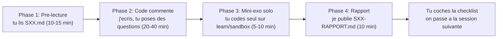

# Mode d'emploi du dispositif pédagogique

> Comment utiliser efficacement le dossier `docs/learn/` pour apprendre la stack Exameo.

## La promesse

Tu apprends **par la pratique** sur un projet réel (Exameo), avec un dispositif structuré pour ne pas te noyer. Chaque techno nouvelle est introduite en 4 temps : tu lis un mini-cours, tu regardes coder en suivant l'explication, tu reproduis seul, tu reçois un rapport-résumé.

## Les 3 ingrédients du dispositif

### 1. Les cours rétroactifs (`01-` à `10-`)

Couvrent ce qui est **déjà construit** dans Exameo (Sprint 0 livré). À lire dans l'ordre numéroté pour respecter les pré-requis :

```
01-docker.md
02-spring-boot.md
03-postgres-flyway.md
04-keycloak-oidc.md
05-spring-security-resource-server.md
06-nextjs-app-router.md
07-nextauth-keycloak.md
08-kafka.md
09-observabilite-otel.md
10-gradle-multimodule.md
```

Chaque cours suit la **même structure** (pour t'habituer à un format prévisible) :

1. **Pourquoi cette techno existe** — quel problème elle résout, quelles alternatives existaient avant
2. **Mental model** — un schéma + 3 lignes pour ancrer le concept dans ta tête
3. **Vocabulaire** — 10-15 termes nouveaux que tu vas croiser
4. **Anatomie** — on ouvre les **vrais fichiers Exameo** et on les annote ligne par ligne
5. **Tu joues** — un mini-exercice à faire sur la branche Git `learn/sandbox`
6. **Pour aller plus loin** — 3-5 ressources externes triées (doc officielle, vidéos, articles)

**Durée cible** : 30 à 60 minutes par cours, lecture + exercice inclus.

**Suivi** : coche le cours dans la carte de progression du [`README.md`](./README.md) quand tu l'as fait.

### 2. Les sessions guidées (`sessions/SXX-...`)

À partir du Sprint 1 (`exam-service`), chaque feature livrée est **découpée en sessions** de 30-90 min, chacune accompagnée :

- d'une **pré-lecture** `SXX-titre.md` : le cours théorique à lire **avant** de toucher le code
- d'un **rapport** `SXX-titre-RAPPORT.md` : le bilan **après** la session avec recap, glossaire delta, mini-exercice solo, checklist

Le découpage est **fin** (pas de "session de 4h"), pour respecter ton format court préféré.

### 3. Le glossaire transverse (`00-vocabulaire.md`)

Dictionnaire de **70+ termes** que tu vas croiser partout (container, JWT, OIDC, RSC, ORM, idempotence, span...). Chaque terme a une définition simple + un exemple chez Exameo. À garder ouvert dans un onglet pendant la lecture des cours.

Le glossaire **grandit** avec le projet : à chaque nouveau concept introduit, je l'ajoute.

## Le workflow type d'une session "cours + code"

Pour les sessions guidées (`sessions/`) :



### Phase 1 — Pré-lecture

Je te ping quand `SXX-titre.md` est prêt. Tu le lis tranquille (10-15 min). Tu n'es pas obligé de tout retenir, juste comprendre le **pourquoi** et le **mental model** avant qu'on touche au code.

### Phase 2 — Code commenté

J'implémente la feature en **expliquant chaque fichier dans le chat** (pourquoi je crée tel fichier, à quoi sert telle annotation). Les commentaires de code restent rares : on préfère la doc dédiée.

Tu peux **m'arrêter à tout moment** en tapant ta question. Pas de question bête.

### Phase 3 — Mini-exercice solo

À la fin de la session, je te propose un changement à faire **toi-même** sur la branche `learn/sandbox`. Exemples :

- "Ajoute un champ `description` à l'entité `Exam`, fais la migration Flyway, expose-le dans le DTO"
- "Crée un endpoint `GET /exams/{id}/stats` qui renvoie le nombre de tentatives"

Tu codes seul, tu commit, tu push. Je vérifie ensuite et je t'envoie un retour.

### Phase 4 — Rapport

Je publie `SXX-titre-RAPPORT.md` avec :

- **Le contexte en 30 secondes** : pour quelqu'un qui n'a pas suivi, pourquoi cette session
- **Ce que tu sais maintenant** : liste des compétences acquises
- **Le mental model** : schéma de ce qu'on a construit
- **Le vocabulaire delta** : nouveaux termes introduits cette session (ajoutés au glossaire transverse)
- **Ce qu'on a fait, fichier par fichier** : chemin + pourquoi + extrait annoté
- **Le flux complet en action** : diagramme de séquence
- **L'exercice à faire** : avec étapes et résultat attendu
- **Erreurs courantes** : symptôme → cause → diag → fix
- **Pour aller plus loin** : 3 liens externes
- **Checklist compétences** : cases à cocher

## La branche `learn/sandbox`

Une branche Git dédiée à tes expérimentations. Elle est **poussée sur GitHub** mais ne sert qu'à toi. Tu peux y faire n'importe quoi sans risquer de casser `main`.

### Démarrer un exercice

```bash
git checkout learn/sandbox
git pull origin learn/sandbox
# ... tu fais ton exercice ...
git add .
git commit -m "exo S01: ajoute champ description a Exam"
git push origin learn/sandbox
```

### Recommencer à zéro après avoir tout cassé

```bash
git checkout learn/sandbox
git reset --hard origin/main   # repart de l'etat de main
git push --force-with-lease origin learn/sandbox
```

### Reprendre les nouveautés de `main`

```bash
git checkout learn/sandbox
git fetch origin
git rebase origin/main         # rejoue tes commits sandbox sur le nouveau main
git push --force-with-lease origin learn/sandbox
```

> Le `--force-with-lease` est plus sûr que `--force` : il refuse le push si quelqu'un d'autre a poussé entre-temps. Sur `learn/sandbox` tu es seul, donc c'est sans danger.

## Rythme conseillé

- **Cours rétroactifs** : 1 par jour (5 jours ouvrés = 50 % du chemin, 2 semaines = tout)
- **Sessions guidées** : 1 ou 2 par semaine selon ta dispo

Tu peux aller plus vite ou plus lentement, c'est ton tempo. L'important est de **ne pas avancer sans avoir compris** le précédent (sinon les cours suivants sont du chinois).

## Ce que tu fais entre deux sessions

- **Lis le glossaire** sur les termes que tu as croisés sans les comprendre
- **Joue avec la sandbox** : casse, corrige, expérimente
- **Note tes questions** dans un fichier (ou un fil de chat) pour me les poser à la prochaine session
- **Lis les ADRs** dans [`../adr/`](../adr/) : ils complètent les cours par le **pourquoi des choix**

## Qu'est-ce qui est "interdit" pendant une session ?

Rien. Tu peux poser **toutes** les questions, même les "évidentes". Quelques exemples valides :

- "C'est quoi `@Entity` exactement ?"
- "Pourquoi tu mets ça dans un fichier `application.yml` et pas dans le code ?"
- "Pourquoi Java et pas Python pour ce service ?"
- "Le mot `bean` me perturbe, on en avait parlé où ?"
- "J'ai pas compris la 3e ligne de ton snippet"

Mieux vaut 10 questions sur un concept jusqu'à ce que ça soit clair, que d'avancer en faisant semblant.

## Si tu reviens après plusieurs jours / semaines

Pas de panique. Lis :

1. La carte de progression du [`README.md`](./README.md) → où tu en étais
2. Le **dernier rapport** que tu as terminé → recap visuel
3. Le **mental model** du prochain cours → 30 secondes de remise en bouche
4. Tu reprends.

Le format des cours et rapports est fait pour être consultable en mode **référence** plus tard, pas seulement en première lecture.

## Vocabulaire spécifique au dispositif

| Terme | Signification |
|---|---|
| **Cours rétroactif** | Cours qui couvre une techno **déjà en place** (Sprint 0) |
| **Session guidée** | Cycle 4 phases pour livrer une **nouvelle** feature avec pédagogie |
| **Sandbox** | La branche `learn/sandbox` où tu expérimentes sans risque |
| **Mini-exercice** | Tâche concrète à faire seul, taillée pour 5-15 min |
| **Glossaire delta** | Nouveaux termes ajoutés au glossaire après une session |
| **Mental model** | Schéma simple pour ancrer un concept dans la tête |
| **From-zero** | Style d'écriture qui suppose **zéro connaissance préalable** de la techno |

## Et après les 10 cours + Sprint 1 ?

Le projet continue : Sprint 2 (passage examen), Sprint 3 (IA + proctoring), Sprint 4 (i18n + a11y). Le format pédagogique reste le même. À chaque nouveau concept introduit, on ajoute un cours dédié (ex : `11-mediapipe.md` quand on attaquera l'anti-triche caméra).

À terme, `docs/learn/` devient un **livre complet** sur les microservices modernes, écrit autour d'un projet réel et fonctionnel.
