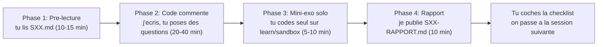

# Sessions de développement guidé

> Timeline ordonnée des sessions de développement en mode **cours + code**. À partir de Sprint 1 (`exam-service`), chaque feature livrée passe par une session pédagogique avec mini-cours, code commenté, mini-exercice solo et rapport.

## Comment lire cette timeline ?

Chaque entrée représente une session de **30 à 90 minutes** de travail (selon la complexité). Pour chaque session :

- **Pré-lecture** (`SXX-titre.md`) : le mini-cours à lire **avant** de toucher le code (théorie, mental model, concepts nouveaux)
- **Rapport** (`SXX-titre-RAPPORT.md`) : le bilan livré **après** la session (recap fichiers, glossaire delta, mini-exercice solo, checklist de compétences)

Voir [`../HOW-TO-USE.md`](../HOW-TO-USE.md) pour le détail du workflow en 4 phases.

## Légende des statuts

| Statut | Signification |
|---|---|
| À planifier | Session identifiée mais pas encore détaillée |
| À lire | Pré-lecture rédigée, en attente de toi |
| En cours | Code en cours d'écriture avec toi |
| Terminée | Code mergé + rapport publié + mini-exercice fait |

## Timeline

| # | Titre | Sprint | Statut | Pré-lecture | Rapport |
|---|---|---|---|---|---|
| - | (Aucune session encore. La première sera `S01-exam-service-bootstrap` après que tu auras digéré au moins le cours `02-spring-boot.md`) | - | - | - | - |

## Prochaines sessions prévues (Sprint 1 — `exam-service`)

À venir, dans cet ordre approximatif :

1. **S01 — exam-service bootstrap** : créer le module Gradle, l'application Spring Boot, l'entité `Exam`, le repository
2. **S02 — exam-service migrations** : Flyway V1 (table `exams`, index, contraintes), seed data dev
3. **S03 — exam-service REST API** : endpoints CRUD `/exams`, validation Bean Validation, mapping DTO
4. **S04 — exam-service sécurité** : intégration Spring Security Resource Server, contrôle d'accès par rôle
5. **S05 — exam-service tests** : tests d'intégration Testcontainers (Postgres + Keycloak)
6. **S06 — exam-service banque de questions** : entités `Question`, `Choice`, types (QCM, vrai/faux, ouverte)
7. **S07 — exam-service événements Kafka** : publication `exam.created`, `exam.updated`
8. ...

Cette liste évoluera au fur et à mesure. Chaque session validée déplace la suivante en "À planifier".

## Convention de nommage

- `S01`, `S02`, ... : numéro séquentiel sur l'ensemble du projet (pas par sprint)
- Slug court en kebab-case
- Suffixe `-RAPPORT.md` pour le bilan post-session

Exemples : `S01-exam-service-bootstrap.md`, `S01-exam-service-bootstrap-RAPPORT.md`

## Comment je suis guidé pendant une session ?

## Pour aller plus loin

- Index des cours rétroactifs : [`../README.md`](../README.md)
- Vocabulaire : [`../00-vocabulaire.md`](../00-vocabulaire.md)
- Mode d'emploi détaillé : [`../HOW-TO-USE.md`](../HOW-TO-USE.md)
